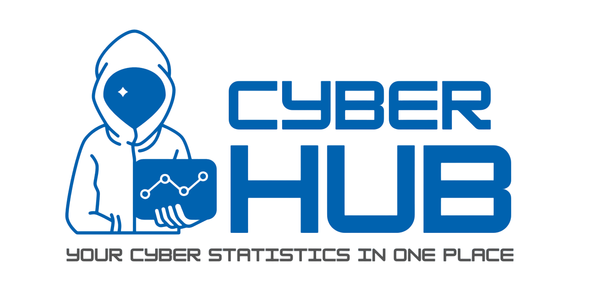

  

As part of my 3rd year Cyber Security project, I am creating a Python application that collects cybercrime-related data from the Internet. The application will be built with the use of the following tools:

- [Streamlit](https://streamlit.io/) - an open-source Python library that makes it easy to create and share beautiful, custom web apps for machine learning and data science.   
- [Beautiful Soup](https://www.crummy.com/software/BeautifulSoup/) - a library for pulling data out of HTML and XML files
- [Pandas](https://pandas.pydata.org/) - a library for data manipulation and analysis
- [Plotly](https://plotly.com/python/) - a graphing library for creating interactive, publication-quality graphs
- [Requests](https://requests.readthedocs.io/en/master/) - a library for making HTTP requests
- and many more...
  
As you may have noticed, the application will present the data in the form of charts and graphs as a web application. The applcation is in the early stages of development, so if like what you see in [here](https://cyberproject-marcinrusiecki.streamlit.app/), please :star: the repository and <a href="https://github.com/martin-ruseq" target="_blank" style="background-color: #0366d6; color: white; padding: 10px 20px; border-radius: 5px; text-decoration: none; font-weight: bold; display: inline-block;">Follow Me</a> on GitHub to stay up to date with the latest changes and new features that will be adding regularly for the next few weeks.

## Installation and Usage :computer:

1. Clone the repository using `git clone https://github.com/martin-ruseq/CyberProject-Y3.git`
2. Install the required libraries using `pip install -r requirements.txt`.
3. Run the application using `streamlit run cyber-data-collector-app.py`.

## Production Environment :rocket:

 
## Code of Conduct 📄
Please note that this project has a Code of Conduct. By participating in this project, you agree to abide by its terms. See the [Conduct Of Code](./CODE_OF_CONDUCT.md) for more information.

## Contributing :handshake:
Here you can find the [Contributing Guidelines](./CONTRIBUTING.md) for this project.

## Security Policy ⚖️
Here you can find the [Security Policy](./SECURITY.md) for this project.

## License 📜
This project is licensed under the MPL v2. See the [LICENSE](LICENSE) file for more information.
